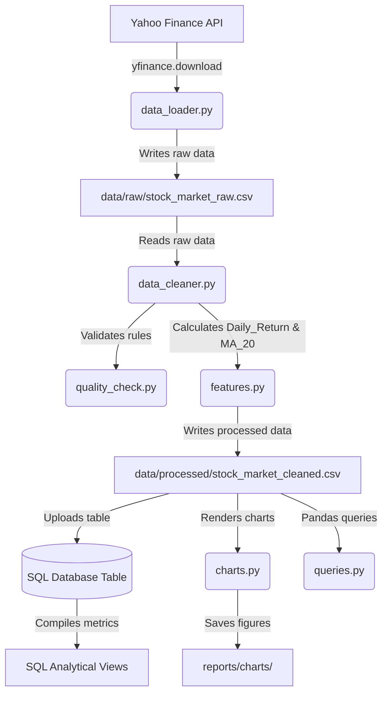

# System Architecture & Data Flow

This document details the software architecture and component relationships for the Stock Market Dashboard pipeline.

## 1. Directory Blueprint

- **`config/`**: System environments, DB connection endpoints, file routes, and credentials configurations.
- **`src/`**: Modular logic package containing ingestion, cleaning, transformation, validation, and analytics code.
- **`scripts/`**: Orchestration scripts (triggers and setup actions).
- **`sql/`**: Relational schemas, view aggregates, and analytic scripts.
- **`tests/`**: Unit test suite verifying modules against expected rules.
- **`data/`**: Subdivided storage (raw dataset copies, processed CSVs, interim samples).

## 2. Component Design & Code Flow

## 3. Orchestrator (`run_pipeline.py`)

The main workflow script wraps this entire execution loop in exception handlers and structured logging statements:
1. `fetch_stock_data()` and `save_raw_data()` from `src.ingestion`.
2. `clean_stock_data()` from `src.cleaning`.
3. `run_quality_checks()` from `src.validation`.
4. `add_technical_indicators()` from `src.transformation`.
5. `save_clean_data()` from `src.cleaning`.
6. `setup_db()` from `scripts` to init schemas and views.
7. Database `append` to populate SQL table.
8. `generate_all_plots()` from `src.visualization`.
9. Log query outputs from `src.analysis.queries`.
