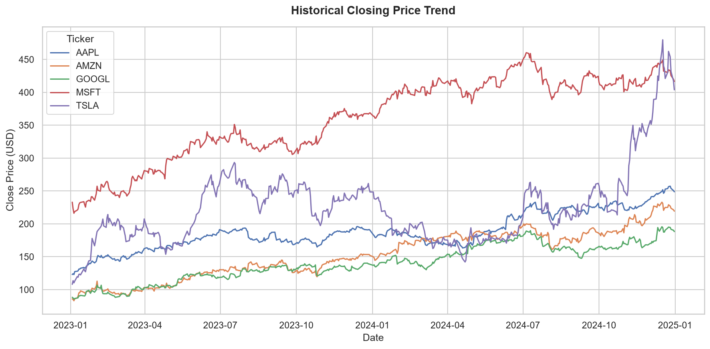
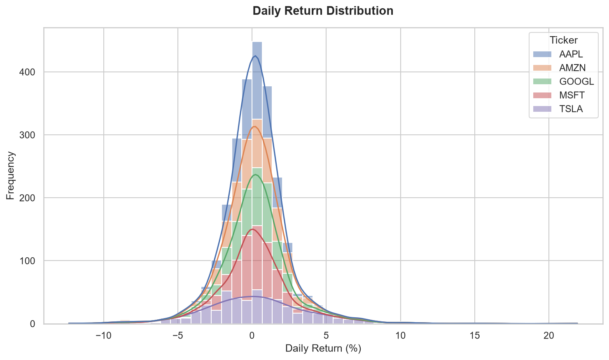

# Automated Stock Market Intelligence Report

This report compiles historical price averages and returns volatility metrics.

## 1. Stock Price Valuations (Average Close Price)

| Ticker   |   Avg_Close_Price |
|:---------|------------------:|
| MSFT     |           360.518 |
| TSLA     |           224.071 |
| AAPL     |           187.896 |
| AMZN     |           153.127 |
| GOOGL    |           140.247 |

## 2. Risk & Volatility Profile (Returns Standard Deviation)

| Ticker   |   Avg_Daily_Return |   Min_Daily_Return |   Max_Daily_Return |   Volatility_Daily_Return |
|:---------|-------------------:|-------------------:|-------------------:|--------------------------:|
| AAPL     |           0.149762 |           -4.8167  |            7.26491 |                   1.3452  |
| AMZN     |           0.206052 |           -8.78471 |            8.26934 |                   1.92896 |
| GOOGL    |           0.168107 |           -9.50941 |           10.2244  |                   1.84036 |
| MSFT     |           0.126254 |           -6.05276 |            7.24346 |                   1.42856 |
| TSLA     |           0.329729 |          -12.3346  |           21.919   |                   3.67297 |

## 3. Visual Performance Trends

- Closing Price Trend:
  
- Daily Return Distribution:
  
